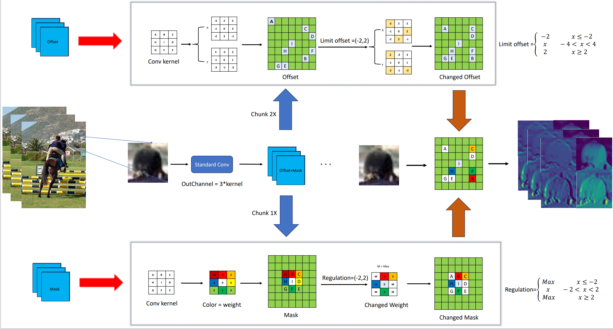

# Enhancing Geometric Modeling in Convolutional Neural Networks: Limit Deformable Convolution
This codebase serves as the open-source implementation for our research paper titled 'Enhancing Geometric Modeling in Convolutional Neural Networks: Limit Deformable Convolution.' Feel free to explore and utilize the code for your reference and research purposes.

## Abstract
Traditional convolutional neural networks are limited in their ability to model geometric transformations due to their fixed geometric structure. To overcome this problem, researchers have introduced deformable convolution, which allows the convolution kernel to be deformable on the feature map. However, deformable convolution may introduce irrelevant contextual information during the learning process and thus affect the model performance.DCNv2 introduces a modulation mechanism to control the diffusion of the sampling points to control the degree of contribution of offsets through weights, but we find that such problems still exist in practical use. Therefore, we propose a new constrained deformable convolution to address this problem, which enhances the modeling ability by adding adaptive limiting units to constrain the offsets, and adjusts the weight constraints on the offsets to enhance the image focusing ability. In the subsequent work, we performed a lightweight work on the restriction deformable convolution and designed three kinds of LDBottleneck to adapt to different scenarios. Our restricted deformable network equipped with the optimal LDBottleneck improves mAP75 by 1.4\% compared to DCNv1 and 1.1\% compared to DCNv2 on the VOC2012+2007 dataset. On the CoCo2017 dataset, different Backbones equipped with our restricted deformable module all achieve good results.



## datasets
Train and validate the model on the trainval split of VOC2007 and VOC2012 datasets. Evaluate the model on the test split of VOC2007.  
The PASCAL VOC2007 dataset is available at http://host.robots.ox.ac.uk/pascal/VOC/voc2007/  
The PASCAL VOC2012 dataset is available at http://host.robots.ox.ac.uk/pascal/VOC/voc2012/  
The CoCo2017 dataset is available at https://cocodataset.org/
## install&Usage
"Enter the project and run the code."
```bash
pip install -r requirements.txt
python main.py


